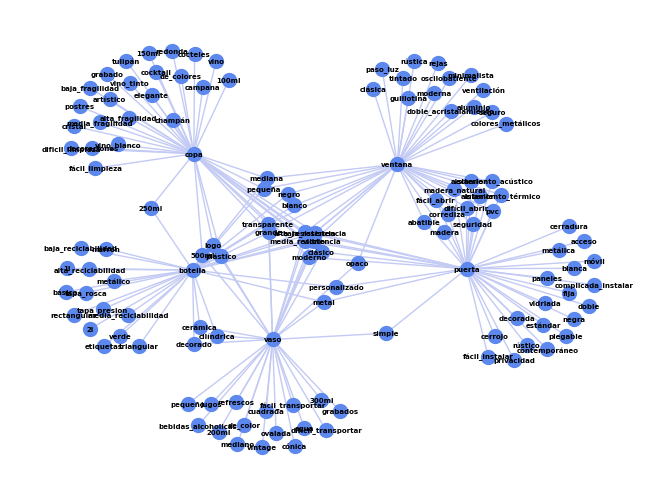

# 🧠 Manto de Markov

**Manto de Markov** es un modelo conceptual y computacional inspirado en las Cadenas de Markov, enfocado en simular mecanismos cognitivos como la percepción, el aprendizaje y la toma de decisiones. Utiliza una estructura de grafos para modelar memorias, conceptos y características, permitiendo no solo la representación estructural del conocimiento, sino también su evolución y razonamiento a través del tiempo.

---

## 🎯 Objetivo

Modelar el aprendizaje y la percepción como un sistema de razonamiento estructural (en lugar de probabilístico), permitiendo la creación, consolidación y análisis de nuevos conocimientos mediante grafos conectados semánticamente.

---

## 🧩 Fundamentos del Modelo

- Cada **nodo** representa una memoria, concepto o característica.
- Las **conexiones (aristas)** representan relaciones o similitudes.
- El aprendizaje ocurre cuando nuevas características se conectan a las existentes.
- Se generan **subgrafos** activos que simulan memoria a corto plazo.
- Una función de consolidación fortalece conexiones relevantes (como el hipocampo humano), simulando memoria a largo plazo.
- Información temporalmente irrelevante queda en estado latente como "nodos remanentes".

---

## 🧠 Inspiraciones Cognitivas

### 📘 Modelo Atkinson-Shiffrin

- **Memoria Sensorial**: Entrada inmediata de información desde los sentidos.
- **Memoria a Corto Plazo**: Nodo activo en el grafo, acceso rápido.
- **Memoria a Largo Plazo**: Nodos con conexiones reforzadas por frecuencia de uso.

### 🌐 Teoría de Prototipos (Rosch)

- Categorización basada en características compartidas.
- Agrupación de nodos por similitud mediante algoritmos de *clustering*.
- Multiconectividad para mantener flexibilidad conceptual.

---

## 🧮 Simulación

El sistema está diseñado para permitir:
- Clasificación y análisis de información mediante patrones.
- Razonamiento estructural sin necesidad de historial temporal.
- Asimilación progresiva de conocimiento nuevo por conexión con conceptos existentes.

---

## 🛠️ Aplicaciones

- Simulación de procesos cognitivos (memoria, percepción).
- Clasificación de objetos por características compartidas.
- Modelado de decisiones basadas en experiencias previas.
- Arquitecturas de IA con aprendizaje no probabilístico.

---

## 🔍 Ejemplo de Comportamiento

```text
Nuevo objeto:
 - Forma: circular
 - Color: rojo
 - Olor: dulce

El sistema conecta cada característica con nodos existentes.
Si el patrón es similar a "manzana", se consolida como tal.
Si no existe una coincidencia suficiente, se crea un nuevo subgrafo.
```

---

## 🏆 Resultados

